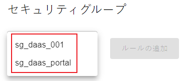
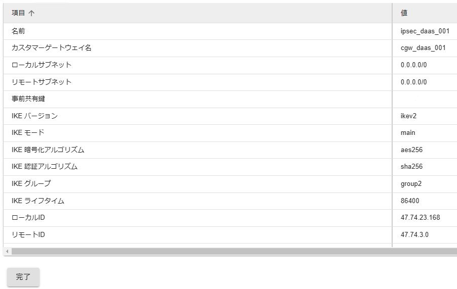

## 1. はじめに
本資料は、管理者向けのCloud Remote Desktop on Alibaba(MultiCloud)操作ポータルを利用するための手順を記述したものです。  
## 2. ログイン
（１）弊社より事前に展開したショートカットより、操作ポータルを開きます。  
※ログインページにて「詳細設定」を開きます。  
   
（２）「xxxxxxにアクセスする」リンクをクリックします。  
    
（３）以下のユーザー名とパスワードを入力し、ログインを押下します。  
・ユーザー名：弊社より事前に展開したもの  
・パスワード：弊社より事前に展開したもの  
  

（４）初めてログインする際はMFA登録を行う必要があります。  
Google Authenticator等、スマートやフォンタブレット等のデバイスを使ったワンタイムパスワードが必要です。  
ここでは Google Authenticator を使用しています。  
> Android 用 Google Authenticator は[こちら](https://play.google.com/store/apps/details?id=com.google.android.apps.authenticator2)からダウンロードしてください。
>
> iOS用 Google Authenticator は[こちら](https://apps.apple.com/app/google-authenticator/id388497605)からダウンロードしてください。  

・Google Authenticator でQRコードを読み込んでください。  
・Google Authenticator に表示された 6桁の認証コードを入力してください。  
・「次へ」をクリックします。  
  

※２回目以降ログインする場合は下記のようなワンタイムパスワード入力画面が表示します。  
  
（５）ログイン成功していることを確認します。  
## 3. 共通ヘッダー
## 3.1 プロバイダー
ヘッダー左側のプロバイダーボタンを押下することで、クラウドプロバイダーごとのデスクトップ一覧を切り替えることができます。  
  
## 3.2 地域
ヘッダー左側の地域ボタンを押下することで、地域ごとのデスクトップ一覧を切り替えることができます。  
※デフォルトは日本（東京）リージョンが選択されています。  
  
## 3.3 ログイン情報
ヘッダー右側に、ご自身のユーザ名と前回ログイン日時が表示されます。  
  
## 3.4 ドキュメント
ヘッダ右側のドキュメントボタンを押下することで、テクニカルサイトにアクセスすることができます。  
  
## 3.5 サポート
ヘッダー右側のサポートボタンを押下することで、ソフトバンク（元SBクラウド）へ問い合わせすることができます。  
※問い合わせは別途弊社のサポートサービスと契約する必要があります。  
  
## 3.6 ログアウト
ヘッダ右側のログアウトボタンを押下することで、ポータルよりログアウトすることができます。  
  
## 4. 管理者メニュー
## 4.1 ダッシュボード
ダッシュボード機能についてご紹介します。  
（１）グループ選択：デスクトップをグループ分けて管理することが可能です。defaultグループは全てのデスクトップが表示されます。  
  
（２）デスクトップ一覧：現在利用中のデスクトップ一覧を確認できます。  
下記パラメータ確認できます。  
- デスクトップ名  
- OSユーザ名  
- ステータス  
- スペック  
- ディスク  
- IPアドレス  
- 課金タイプ  
- 有効期限  
- バーストモード  
- OSバージョン  
  
## 4.2 デスクトップ管理
## 4.2.1 作成・削除
## 4.2.1.1 デスクトップの作成
（１）デスクトップ管理＞作成・削除を選択します。  
  
（２）作成ボタンを押下します。  
  
（３）スペック選択は推奨スペック、あるいはカスタムをご選択ください。  
※本手順ではカスタムを選択します。  
  
（４）デスクトップの作成元イメージを指定します。  
デフォルトのイメージを使用するか、イメージ管理（後述）で作成した任意のイメージを使用します。  
※スペック選択で推奨スペックを選択した場合は指定できません。  
  
（５）システムディスクのタイプとサイズを入力します。  
※本手順ではHDDの40GBとします。  
  
（６）データディスクの有無を指定します。  
**データディスクありの場合**  
個数を入力し、ディスクのタイプとサイズを入力します。  
※本手順では1個のデータディスク（HDD、40GB）を作成します。  
  
**データディスクなしの場合**  
個数に0を入力します。  
  
（７）デスクトップがどのグループに所属するかを選択します。  
- 未所属：defaultのグループに表示されます。  
- 既存のグループから選択：既存のグループより指定します。  
- 新規作成：新規グループ作成します。  

本手順では未所属を選択します。  
  
（８）その他設定  
- VSwitch：デスクトップが所属するVSwitchを選択します。  
- ユーザー名：user-xxx(xxxはインスタンス名のecs_daas_xxxと同じ三桁数字になります。)  
- パスワード：デスクトップのログインパスワードを設定します。（※作成されたデスクトップのユーザー名はuser-xxxとなります。）  
- 課金方式：従量課金またはサブスクリプションを選択します。  
- 作成台数：デスクトップの作成台数を設定します。（2以上を設定した場合、同様なデスクトップが複数作成されます。）  
  
（９）最終確認後、問題なければOKボタンを押下します。  
  
（１０）デスクトップが正しく作成されていることを確認し完了ボタンを押下します。  
  
以上でデスクトップの作成が完了しました。  
※デスクトップ作成は内部処理のため約5分間かかります。5分後作成対象のデスクトップを一度再起動後、ログイン確認お願いいたします。  
## 4.2.1.2 デスクトップの削除
（１）デスクトップ管理＞作成・削除を選択します。  
  
（２）削除したいデスクトップにチェックを入れて削除ボタンを押下します。  
  
（３）最終確認後、OKボタンを押下します。  
  
以上で、デスクトップの削除が完了しました。  
## 4.2.2 起動・再起動・停止
## 4.2.2.1 デスクトップの起動
（１）デスクトップ管理＞起動・再起動・停止を選択します。  
  
（２）デスクトップの起動：  
①デスクトップ一覧より、一台または複数台のデスクトップを選択します。  
②「一括起動」を選択します。  
※「ステータス」が起動中と停止中のタスクを同時に選択することはできません。  
  
（３）ポップアップ画面にて、起動対象のデスクトップを確認します。「OK」を押下します。  
  
（４）処理実行完了まで待ちます。  
※処理中、他のメニューを操作することはできません。  
  
（５）起動が成功したことを確認します。  
「完了」ボタンを押下します。  
  
## 4.2.2.2 デスクトップの再起動
（１）デスクトップ管理＞起動・再起動・停止を選択します。  
  
（２）デスクトップの再起動：  
①デスクトップ一覧より、一台または複数台のデスクトップを選択します。  
②「一括再起動」を選択します。  
※「ステータス」が停止中のデスクトップを選択することはできません。  
  
（３）ポップアップ画面にて再起動対象のデスクトップを確認します。  
「再起動」を押下します。  
※デスクトップがフリーズしている場合は、「強制再起動」を押下します。  
  
（４）処理実行完了まで待ちます。  
※処理中、他のメニューを操作することはできません。  
  
（５）再起動が成功したことを確認します。  
「完了」ボタンを押下します。  
  
## 4.2.2.3 デスクトップの停止
（１）デスクトップ管理＞起動・再起動・停止を選択します。  
  
（２）デスクトップの停止：  
①デスクトップ一覧より、一台または複数台のデスクトップを選択します。  
②「一括停止」を選択します。  
※「ステータス」が停止中、または起動中と停止中複数のデスクトップを選択することはできません。  
  
（３）ポップアップにて停止対象のデスクトップ一覧を確認します。  
「停止」ボタンを押下します。  
※デスクトップがフリーズしている場合は、「強制停止」を押下します。  
  
（４）処理実行完了まで待ちます。  
※処理中、他のメニューを操作することはできません。  
  
（５）タスクが成功したことを確認します。  
「完了」ボタンを押下します。  
  
## 4.2.3 スペック変更
## 4.2.3.1 デスクトップスペック変更
（１）管理者メニューより、「デスクトップ管理」＞「スペック変更」を押下します。  
  
（２）デスクトップ一覧より、変更対象を選択し、デスクトップスペック変更を押下します。  
  
（３）変更後のスペックを選択します。「次へ」を押下します。  
  
（４）変更内容を確認し、問題なければ「OK」を押下します。  
  
（５）変更完了後、デスクトップ一覧にて新しいスペックに変更されていることを確認できます。  
  
## 4.2.3.2 ディスクサイズ変更
（１）管理者メニューより、「デスクトップ管理」＞「スペック変更」を押下します。  
  
（２）デスクトップ一覧より、変更対象を選択し、ディスクサイズ変更を押下します。  
  
（３）変更対象ディスク及び変更後のサイズを選択し、「次へ」を押下します。  
  
（４）変更内容を確認し、問題なければ「OK」を押下します。  
  
（５）変更完了後、デスクトップ一覧にて新しいサイズに変更されていることを確認できます。  
  
## 4.2.3.3 ディスクカテゴリ変更
（１）管理者メニューより、「デスクトップ管理」＞「スペック変更」を押下します。  
  
（２）デスクトップ一覧より、変更対象を選択し、ディスクカテゴリ変更を押下します。  
  
（３）変更対象ディスクを選択し、「次へ」を押下します。  
  
（４）変更内容を確認し、問題なければ「OK」を押下します。  
  
## 4.2.3.4 データディスク追加
（１）管理者メニューより、「デスクトップ管理」＞「スペック変更」を押下します。  
  
（２）デスクトップ一覧より、変更対象を選択し、データディスク追加を押下します。  
  
（３）ディスクの作成方法を選択します。本手順では空のディスクを作成を選択します。  
次へディスクのカテゴリとサイズを選択し、「次へ」を押下します。  
  
（４）変更内容を確認し、問題なければ「OK」を押下します。  
  
（５）追加完了後、デスクトップ一覧にてデータディスクが追加されたことを確認できます。  
  
## 4.2.4 課金タイプ変更
（１）管理者メニューより、「課金タイプ変更」を押下します。  
  
（２）デスクトップ一覧より、変更対象を選択し、「変更」を押下します。  
  
（３）購入期間と自動更新（必要な場合はチェック）を選択し、「次へ」を押下します。  
  
（４）変更内容を確認し、問題なければ「OK」を押下します。  
  
（５）変更完了後、デスクトップ一覧にて課金タイプを確認できます。  
  
## 4.2.5 バーストモード変更
（１）管理者メニューより、「バーストモード変更」を押下します。  
  
（２）デスクトップ一覧より、変更対象を選択し、「無制限モードに変更」を押下します。  
  
（３）変更内容を確認し、問題なければ「OK」を押下します。  
  
（４）変更後、デスクトップ一覧にてバーストモードは「無制限モード」に変更されたことを確認できます。  
  
## 4.2.6 グループ変更
（１）管理者メニューのデスクトップ管理より、「グループ変更」を押下します。  
  
（２）デスクトップ一覧より、変更対象を選択し、「変更」を押下します。  
  
（３）問題ないことを確認したら□にチェックを入れてOKボタンを押下します。  
  
（４）グループが変更されていることを確認します。  

## 4.3 スナップショット管理
## 4.3.1 スナップショットの作成
（１）管理者メニューより、「スナップショット管理」を選択します。  
  
（２）デスクトップ一覧より、作成対象を選択し、「スナップショット作成」を押下します。  
  
（３）対象ディスクを選択し、スナップショットの名前、説明文（任意）を入力し、保存期間を選択の上、「次へ」を押下します。  
  
（４）作成内容を確認し、問題なければ「OK」を押下します。  
  
（５）スナップショット一覧より、スナップショットの進捗を確認できます。  
  
## 4.3.2 スナップショットのロールバック
（１）管理者メニューより、「スナップショット管理」を選択します。  
  
（２）ロールバック対象を選択し、「スナップショット一覧表示＆ロールバック」を押下します。  
  
（３）対象スナップショットを選択し、「ロールバック」を押下します。  
  
（４）ロールバック後、インスタンスを起動するかどうかを選択し、問題なければ、「OK」を押下します。  
  
（５）ロールバックが正しく完了したことを確認します。  
  
## 4.3.3 スナップショットの削除
（１）管理者メニューより、「スナップショット管理」を選択します。  
  
（２）削除対象を選択し、「スナップショット一覧表示＆ロールバック」を押下します。  
  
（３）削除対象スナップショットを選択し、「削除」を押下します。  
  
（４）削除内容を確認し、問題なければ「OK」を押下します。  
  
（５）削除成功したことを確認します。  
  
## 4.4 イメージ管理
## 4.4.1 イメージの作成
（１）管理者メニューより「イメージ管理」を選択します。  
  
（２）「作成」を押下します。  
  
（３）作成方法を選択します。本手順ではデスクトップから作成を選択します。  
対象デスクトップを選択します。  
イメージ名と説明文を入力し、「次へ」を押下します。  
  
（４）作成内容を確認し、問題なければ「OK」を押下します。  
※イメージ作成に時間を要する場合がございます。  
  
（５）作成完了後、イメージ一覧画面より確認できます。  
  
## 4.4.2 イメージの削除
（１）管理者メニューより「イメージ管理」を選択します。  
  
（２）対象イメージを選択し、「削除」を押下します。  
  
（３）イメージに紐づくスナップショットも同時に削除するかどうかを選択し、「OK」を押下します。  
  
（４）イメージが正しく削除されたことを確認します。  
  
## 4.5 スケジュール管理
## 4.5.1 タスクの作成
## 4.5.1.1 定期実行タスク
（１）定期実行タスク（週次繰り返しタスク）の作成ボタンを押下します。  
  
（２）以下のパラメータを入力します。  
①タスク名  
②曜日  
③時間  
④実行内容（起動／停止）  
⑤グループ  
⑥対象デスクトップ  
次へを押下します。  
  
設定内容を確認し、「作成」ボタンを押下します。  
  
タスク作成が正しく完了していることを確認します。  
「完了」ボタンを押下します。  
  
以上で、タスクの作成が完了しました。  
## 4.5.1.2 一回実行タスク
１回実行タスク（１回のみ実行）の作成ボタンを押下します。  
  
以下のパラメータを入力します。  
①タスク名  
②日付  
③時間  
④実行内容（起動／停止）  
⑤グループ  
⑥対象デスクトップ  
次へを押下します。  
  
タスク詳細を確認し、「作成」ボタンを押下します。  
  
タスク作成完了していることを確認します。  
「完了」ボタンを押下します。  
  
以上で、タスクの作成が完了しました。  
## 4.5.2 タスクの編集
## 4.5.2.1 定期実行タスク
作成されたタスクに、デスクトップを追加／削除を実施する場合は、「変更」ボタンを押下します。  
  
スケジュールの対象デスクトップを選び直して、「次へ」を押下します。  
  
タスクの詳細を確認し、「確定」を押下します。  
  
対象デスクトップの変更が完了していることを確認します。  
「完了」ボタンを押下します。  
  
以上で、タスクの編集が完了しました。  
## 4.5.2.2 一回実行タスク
作成されたタスクに、デスクトップを追加／削除を実施する場合は、「変更」ボタンを押下します。  
  
スケジュールの対象デスクトップを選び直して、「次へ」を押下します。  
  
タスクの詳細を確認し、「確定」を押下します。  
  
対象デスクトップの変更が完了していることを確認します。  
「完了」ボタンを押下します。  
  
以上で、タスクの編集が完了しました。  
## 4.5.3 タスクの削除
## 4.5.3.1 定期実行タスク
対象のタスクにチェックを入れます。  
  
削除ボタンを押下します。  
  
削除対象の詳細を確認後、問題なければはいボタンを押下します。  
  
タスクが正しく削除されたことを確認します。  
完了ボタンを押下します。  
  
## 4.5.3.2 一回実行タスク
対象のタスクにチェックを入れます。  
  
削除ボタンを押下します。  
  
削除対象の詳細を確認後、問題なければはいボタンを押下します。  
  
タスクが正しく削除されたことを確認します。  
完了ボタンを押下します。  
  
## 4.6 アイドルタイムアウト管理
左メニューより、「アイドルタイムアウト管理」を押下します。  
  
## 4.6.1 アイドルタイムアウトジョブの作成
（１）ジョブ一覧の作成ボタンを押下します。  
  
（２）ジョブ名と説明を入力します。  
※説明は省略可  
  
（３）本ジョブの処理内容（デスクトップの課金停止 または 作成時のイメージに初期化）を選択します。  
※作成時に選択したイメージが削除されている場合、初期化は失敗します。  
  
（４）アイドルタイムアウトによる処理の実行  
仮想デスクトップが一定時間以上アイドル状態だった場合に処理を実行するかを指定します。  
また、実行する場合は、アイドルタイムを分単位で指定します。  
  
（５）その他の実行オプション  
  
- デスクトップにログオンしているユーザがいない場合に処理を実行するか  
ジョブ実行時にログオン数0を検知した場合に実行するかを指定します。  
- デスクトップがシャットダウン状態かつ課金継続状態の場合に処理を実行するか  
ジョブ実行時にシャットダウン状態かつ課金継続状態を検知した場合に実行するかを指定します。  

（６）処理を実行したいデスクトップを選択します。  
※複数選択可  
  
（７）以上の項目を入力後、「次へ」を押下します。  
  
（８）最終確認後、問題なければOKボタンを押下します。  
  
以上でジョブの作成が完了しました。  

## 4.6.2 アイドルタイムアウトジョブの設定変更
アイドルタイムアウトジョブの設定を変更したい場合は、以下の手順を実施します。  
（１）対象ジョブの「設定変更」ボタンを押下します。  
  
（２）変更したい項目の値を変更します。  
※「ジョブ名」は変更できません。  
  
（３）ジョブの有効状態  
ジョブを無効化したり、過去に無効化したジョブを有効化したりできます。  
  
（４）処理対象のデスクトップを変更したい場合は変更します。  
※複数選択可  
  
（５）以上の項目を入力後、「次へ」を押下します。  
  
（６）最終確認後、問題なければOKボタンを押下します。  
  
以上でジョブの設定変更が完了しました。  
## 4.6.3 アイドルタイムアウトジョブの削除
アイドルタイムアウトジョブを削除したい場合は、以下の手順を実施します。  
（１）対象のジョブにチェックを入れます。  
  
（２）削除ボタンを押下します。  
  
（３）削除対象の詳細を確認後、問題なければ「OK」ボタンを押下します。  
  
（４）「完了」ボタンを押下します。  
  
以上でジョブの削除が完了しました。  
## 4.7 ネットワークリソース管理
## 4.7.1 SAG管理
## 4.7.1.1 SAGインスタンス情報管理
（１）管理者メニューより、「ネットワークリソース管理」＞「SAG管理」を選択します。  
  
（２）SAG APPインスタンス情報より、既存のSAGインスタンスを確認できます。  
  
（３）ユーザー数を変更し、CIDRを追加することもできます。  
  
（４）変更内容を確認し、問題なければ「OK」を押下します。  
  
（５）変更成功後、SAG APPインスタンス情報より確認できます。  
## 4.7.1.2 SAGユーザー情報管理
（１）SAGユーザー情報画面からSAGユーザー情報を確認できます。  
  
（２）ユーザー追加の場合は、メールアドレスとパスワードを入力し、「追加」を押下します。  
  
（３）追加内容を確認し、問題なければ「OK」を押下します。  
  
（４）追加完了後、SAP APPユーザー情報一覧に追加したユーザーを確認できます。  
## 4.7.2 セキュリティグループ
### 4.7.2.1 ルールの表示
（１）管理者メニューより、セキュリティグループを選択します。  

  

（２）プルダウンより表示対象のセキュリティグループを選択します。  

  

（３）対象セキュリティグループのルール一覧が表示されます。  
　　　インバウンドとアウトバウンドタブにてそれぞれのルールが表示されます。  

  

### 4.7.2.2 ルールの追加
（１）インバウンドタブを選択したまま、「ルールの追加」ボタンを押下します。  
※アウトバウンドルールを追加する場合は、アウトバウンドタブを選択したまま、「ルールの追加」ボタンを押下します。  

  
  
以下の項目を入力します。  
・権限付与ポリシー：プルダウンより選択（許可／拒否）します。  
・優先度：1から100までの数値を入力します。デフォルトは1（一番優先度高い）となります。  
・プロトコルタイプ：プルダウンより選択します。  
・ポート範囲：1から65535までの数値を入力します。  
・送信元／送信先：IPアドレスのCIDRフォーマットで入力します。例：47.12.34.56/32、192.168.0.0/24  
・説明（任意）：セキュリティルールの説明文を入力します。  
  
    
  
入力後、

ボタンを押下して、入力を確定します。  
複数ルールを追加する場合は、

ボタンを押下して入力行を追加できます。  
行を削除する場合は、

ボタンを押下して、削除可能です。  
  
（２）追加対象のセキュリティグループを選択します。複数セキュリティグループを追加する場合は、複数チェックをいれます。  

  

（３）「次へ」ボタンを押下します。  

（４）追加内容を確認し、問題なければチェックし、「OK」ボタンを押下します。  

  

（５）ルールが正しく追加されたことを確認します。  

### 4.7.2.3 ルールの削除
（１）削除対象ルール行の「削除」ボタンを押下します。  

  

（２）削除内容を確認し、問題なければチェックを入れ、「OK」ボタンを押下します。  

  

（３）ルールが正しく削除されたことを確認します。  
  
## 4.7.3 NATゲートウェイ
### 4.7.3.1 NATゲートウェイ情報の確認
（１）管理者メニューより、NATゲートウェイを選択します。  

  

（２）基本情報タブにてNATゲートウェイの基本情報を確認することができます。  
  
以下の項目を確認できます。  

・インスタンス名：NATゲートウェイの名前  
・説明：NATゲートウェイの用途  
・VPC：NATゲートウェイと関連付けているVPCのID  
・ステータス：NATゲートウェイのステータス  
・プライベートIP：NATゲートウェイのプライベートIPアドレス  

  
  
（３）関連するEIPタブにて、NATゲートウェイのグローバルIP情報を確認することができます。  
  
以下の項目を確認できます。  

・EIPアドレス：グローバルIPアドレスの値  
・帯域幅：IPアドレスの帯域幅  
・ステータス：IPアドレスのステータス  

### 4.7.3.2 NATゲートウェイの削除
※ポータルの利用はインターネットへの接続が必須のため、有効なIPSec接続がない場合は、NATゲートウェイの「削除」ボタンを押下できません。  
（１）「削除」ボタンを押下します。  

  

（２）NATゲートウェイ以外にインターネットへの接続があることを確認し、「削除」ボタンを押下します。  

  

（３）NATゲートウェイが正しく削除されることを確認します。（削除に2〜3分かかります）  

※削除後すぐ再作成する場合は失敗する可能性があります。非同期削除のため、しばらく時間経ってから再度作成を試してください。  

### 4.7.3.3 NATゲートウェイの作成
（１）「作成」ボタンを押下します。（作成に2〜3分かかります。）  

  

※ポータルからNATゲートウェイを作成する場合は、入力パラメータはありません。  

以下の既定値にて作成されます。  

・インスタンス名：nat-daas  
・説明：Cloud Remote GatewayのNAT Gateway  
・EIP帯域幅：200Mbit/s（トラフィック課金）  

## 4.7.4 VPNゲートウェイ
### 4.7.4.1 VPNゲートウェイの作成
（１）管理者メニューより、VPNゲートウェイを選択します。  

  

（２）「作成」ボタンを押下します。  

  

（３）以下の項目を入力します。  

・宛先CIDRブロック：接続先のプライベートネットワークセグメント。例：192.168.0.0/24  

・カスタマーゲートウェイ：  
　○ IPアドレス：接続先のVPNゲートウェイのグローバルIPアドレス  
　○ ASN（任意）；ASに一意に振られる番号（指定がなければ空欄のままで問題ありません）  
　○ 事前共有鍵（16桁）：接続先と共有する事前共有鍵を入力します。（入力なければ自動で作成します。）  

・IKEバージョン：プルダウンより選択します。（デフォルト：ikev2）  
・IKEネゴシエーションモード：プルダウンより選択します。（デフォルト：main）  
・IKE暗号化アルゴリズム：プルダウンより選択します。（デフォルト：aes256）  
・IKE認証アルゴリズム：プルダウンより選択します。（デフォルト：sha256）  
・IKE DHグループ：プルダウンより選択します。（デフォルト：group2）  
・IKE SAライフサイクル：SAライフサイクルを入力します。（デフォルト：86400）  

・IPSec暗号化アルゴリズム：プルダウンより選択します。（デフォルト：aes256）  
・IPSec認証アルゴリズム：プルダウンより選択します。（デフォルト：sha256）  
・IPSec DHグループ：プルダウンより選択します。（デフォルト：group2）  
・IPSec SAライフサイクル：SAライフサイクルを入力します。（デフォルト：86400）  

・DPD： ON／OFFを選択します。（デフォルト：ON）  
・NATトラバーサル：ON／OFFを選択します。（デフォルト： ON）  

（４）作成内容を確認し、問題なければチェックを入れ、「OK」ボタンを押下します。  

  

（５）VPNゲートウェイが正しく作成されることを確認します。  

### 4.7.4.2 VPNゲートウェイの確認
（１）基本情報タブにてVPNゲートウェイの基本情報を確認できます。

  

（２）「ルート確認」ボタンを押下し、VPNゲートウェイに設定された宛先CIDRブロックを確認できます。  

  

（３）IPSECコネクションタブにてIPSECの情報を確認できます。  

  

（４）「詳細表示」ボタンを押下し、詳細なIPSEC設定情報を確認できます。  

  

※事前共有鍵を自動作成する場合は、こちらのメニューより確認できます。  

### 4.7.4.3 VPNゲートウェイの削除
（１）IPSecコネクションの「削除」ボタンを押下します。  
※ポータルの利用はインターネットへの接続が必須のため、有効なNATゲートウェイ接続がない場合は、IPSec接続の「削除」ボタンを押下できません。  

  

（２）削除内容を確認し、問題なければチェックをいれ、「OK」ボタンを押下します。（※削除に2〜3分かります。）  

  

（３）IPSec接続が正しく削除されたことを確認します。  

（４）VPNゲートウェイの「削除」ボタンを押下します。  

  

（５）削除内容を確認し、問題なければチェックをいれ、「OK」ボタンを押下します。  

  

（６）VPNゲートウェイが正しく削除されたことを確認します。  

※削除後すぐ再作成する場合は失敗する可能性があります。非同期削除のため、しばらく時間経ってから再度作成を試してください。 

### 4.7.4.4 IPSecコネクションの追加
※上記「4.7.4.3 VPNゲートウェイの削除」章にてIPSecコネクションを削除後、追加ボタンが押下できるようになります。  
  
こちらにて、既存のVPNゲートウェイを保持したままで、新規IPSecコネクションを再作成することができます。  
入力パラメーターは「4.7.4.1 VPNゲートウェイの作成」章をご参照ください。  

## 4.8.2 ユーザ管理
## 4.8.2.1 新規ユーザ作成
ポータルユーザには管理者ユーザと一般ユーザの2種類が存在します。  
それぞれのユーザを新規作成する手順は以下の通りです。  
## 4.8.2.1.1 新規管理者ユーザ作成
管理メニューよりユーザ管理を押下します。  
  
「管理者ユーザ管理」の作成ボタンを押下します。  
  
以下の情報を入力し、OKボタンを押下します。  
- ユーザ名  
- パスワード  
  
ユーザーが正しく作成されたことを確認します。  
  
以上で、新規管理者ユーザーの作成が完了します。  
## 4.8.2.1.2 新規一般ユーザ作成
管理メニューよりユーザ管理を押下します。  
  
「一般ユーザ管理」の作成ボタンを押下します。  
  
以下の情報を入力し、OKボタンを押下します。  
- ユーザ名  
- パスワード  
- 対象デスクトップ  
  
最終確認後、問題なければOKボタンを押下します。  
  
ユーザーが正しく作成されたことを確認します。  
  
以上で、新規管理者ユーザーの作成が完了します。  
## 4.8.2.2 既存ユーザーパスワード変更
管理メニューよりユーザ管理を押下します。  
  
対象ユーザーのパスワード変更ボタンを押下します。  
  
新しいパスワードを入力し、OKボタンを押下します。  
  
以下のメッセージが表示されると完了です。  
  
## 4.8.2.3 既存ユーザー削除
管理メニューよりユーザ管理を押下します。  
  
対象ユーザーの削除ボタンを押下します。  
  
削除対象を確認し、問題なければOKを押下します。  
  
ユーザーが削除されたことを確認します。  
  
## 4.8.2.4 既存ユーザーMFA初期化
管理メニューよりユーザ管理を押下します。  
  
対象ユーザーのMFA初期化ボタンを押下します。  
  
問題ないことを確認したら□にチェックを入れてOKボタンを押下します。  
  
以下のメッセージが表示されると完了です。  
  
## 4.8.2.5 既存一般ユーザー連携デスクトップ変更
管理メニューよりユーザ管理を押下します。  
  
対象一般ユーザーの変更ボタンを押下します。  
  
以下の情報を入力し、次へボタンを押下します。  
- 既存のデスクトップ紐付け情報を残しますか？：  
別プロバイダーのデスクトップ紐づけ情報を残したい場合はチェックを入れます。  
- 対象デスクトップ選択：  
対象一般ユーザーに紐付けたいデスクトップを一覧から選択します。  
  
問題ないことを確認したら□にチェックを入れてOKボタンを押下します。  
  
以下のメッセージが表示されると完了です。  
  
## 4.8.2.6 既存ユーザーロック解除
管理メニューよりユーザ管理を押下します。  
  
対象ユーザのロック解除ボタンを押下します。  
※ロック中のユーザだけロック解除ボタンが表示されます。  
  
問題ないことを確認したら□にチェックを入れてOKボタンを押下します。  
  
以下のメッセージが表示されると完了です。  
  